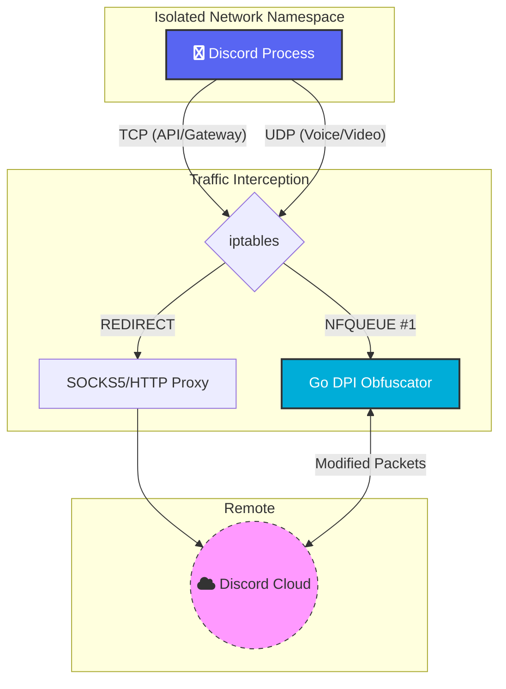

# System Architecture

This diagram illustrates how the tool intercepts and processes Discord traffic using Network Namespaces, iptables, and a custom Go-based DPI obfuscator.

## Traffic Flow Diagram

## Components Description

1.  **Network Namespace**: Isolates the Discord process to ensure all traffic is captured.
2.  **iptables REDIRECT**: Routes TCP traffic (API/Gateway) through a local SOCKS5/HTTP proxy.
3.  **iptables NFQUEUE**: Sends UDP traffic (Voice/Video) to the Go program for real-time DPI manipulation.
4.  **Go Program**: Performs packet fragmentation or obfuscation to bypass network restrictions.